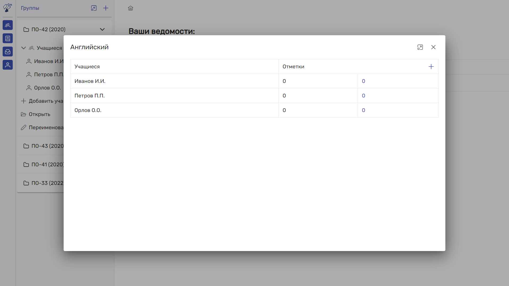
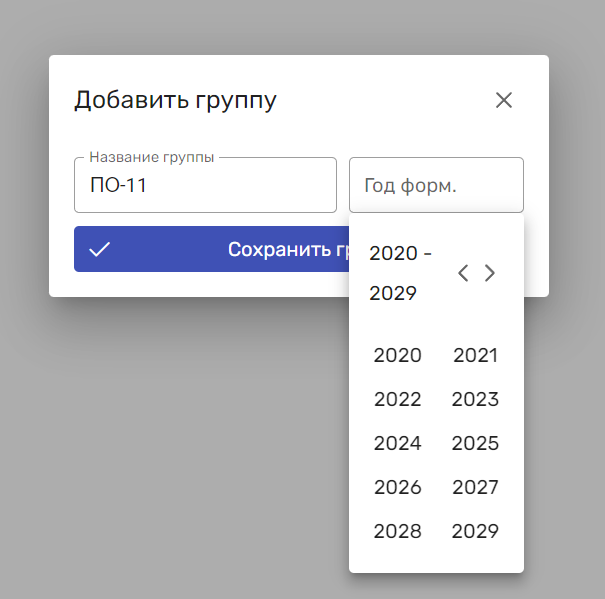

# Curatorium

## О проектке

Curatorium - сервис, предоставляющий услуги для управления ведомостями. 


## Технологии

### frontend

* Vue 3
* PrimeVue
* Axios
* Vue-router
* Js-cookie
* Jwt-decode
* Vuex 

### backend

* Spring Boot 3 (включая стартер для тестов и configuration processor)
* Spring Data jpa 
* Spring Security
* Spring MVC
* OpenApi Docs
* Hibernate Validation
* Gradle
* Liquibase
* Lombok
* Mapstruct
* JJWT
* H2  


## Исспользование

### Запуск сервиса

```
docker compose up
```

После запуска будут созданы 2 Docker-образа:

* curatorium-client
* curatorium-server

Также будут созданы 3 контейнера:

* curatorium-server-app
* curatorium-client-app
* curatorium-server-db

Сервис работает на 3 портах:

* 5173 - frontend
* 8081 - backend
* 5432 - postgresql

### Завершение работы сервиса

```
docker compose down
```

## Возможности

Благодаря Curatorium вы можете:

1. Вести учет учащихся, состоящих в одной группе.

   

2. Просмотр информации о группе и её изменение.

    

3. Управление предметами (дисциплинами)

    

4. Создание, изменение, удаление и ведение ведомостей по группе.

    

    

## Изображения







